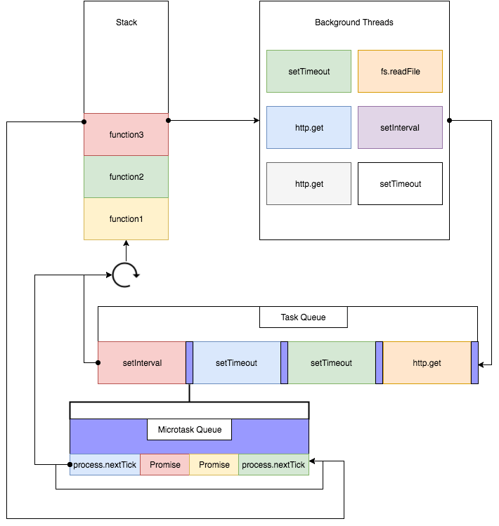

### 常见的JavaScript知识点

#### 继承

##### 继承的目的

让子类的实例同时也具备父类中私有的属性和公共的方法

##### 继承的实现方式

+ 原型继承

  ```js
  function Parent() {
  	this.x = 100;
  }
  Parent.prototype.getX = function getX() {
  	return this.x;
  };
  
  function Child() {
  	this.y = 200;
  }
  //=> 让子类的原型等于父类的实例
  Child.prototype = new Parent; //=>原型继承
  
  Child.prototype.getY = function getY() {
  	return this.y;
  };
  
  let c1 = new Child;
  console.log(c1); 
  
  
  ```

+ Call 继承(只能继承父类中私有的,不能继承父类中公共的)
+ ES6 class Construcors (与 jsx 语法 一致 )

```js
// 继承: extends Parent（类似于寄生组合继承）
// 注意：继承后一定要在CONSTRUCTOR第一行加上SUPER
class Child extends Parent {
	constructor() {
		super(); //=>类似于我们之前的CALL继承  super(100,200)：相当于把Parent中的constructor执行，传递了100和200
		this.y = 200;
	}
	getY() {
		return this.y;
	}
}
let c1 = new Child;
console.log(c1);

// Child(); //=>Uncaught TypeError: Class constructor Child cannot be invoked without 'new'  ES6中创建的就是类，不能当做普通函数执行，只能new执行

```


#### 原型链

+ 每个函数上都有一个`prototype`属性；这个属性指向函数的原型对象。

```js
function Person(age) {
    this.age = age       
}
Person.prototype.name = 'kavin'
var person1 = new Person()
var person2 = new Person()
console.log(person1.name) //kavin
console.log(person2.name)  //kavin
```


+ 每个对象(除null外)都会有的属性，叫做`__proto__`，这个属性会指向该对象的原型。

```js
function Person() {

}
var person = new Person();
console.log(person.__proto__ === Person.prototype); // true
```


+ 每个原型都有一个constructor属性，指向该关联的构造函数。

```js
function Person() {

}
console.log(Person===Person.prototype.constructor)  //true
```


```js
function Person() {

}

var person = new Person();

console.log(person.__proto__ == Person.prototype) // true
console.log(Person.prototype.constructor == Person) // true
// 顺便学习一个ES5的方法,可以获得对象的原型
console.log(Object.getPrototypeOf(person) === Person.prototype) // true
```


补充

```js
function Person() {

}
var person = new Person();
console.log(person.constructor === Person); // true

当获取 person.constructor 时，其实 person 中并没有 constructor 属性,当不能读取到constructor 属性时，会从 person 的原型也就是 Person.prototype 中读取，正好原型中有该属性，所以：

person.constructor === Person.prototype.constructor

....
读取实例的属性时，如果找不到，就会查找与对象关联的原型中的属性，如果还查不到，就去找原型的原型，一直找到最顶层为止。


function Person() {

}

Person.prototype.name = 'Kevin';

var person = new Person();

person.name = 'Daisy';
console.log(person.name) // Daisy

delete person.name;
console.log(person.name) // Kevin
```

其实原型对象就是通过 Object 构造函数生成的，结合之前所讲，实例的 __proto__ 指向构造函数的 prototype ，所以我们再更新下关系图：


>每个构造函数都有一个原型对象，原型对象都包含一个指向构造函数的指针，而实例都包含一个指向原型对象的内部指针。那么假如我们让原型对象等于另一个类型的实例，结果会怎样？显然，此时的原型对象将包含一个指向另一个原型的指针，相应地，另一个原型中也包含着一个指向另一个构造函数的指针。假如另一个原型又是另一个类型的实例，那么上述关系依然成立。如此层层递进，就构成了实例与原型的链条。这就是所谓的原型链的基本概念。——摘自《javascript高级程序设计》

```js
console.log(Object.prototype.__proto__ === null) // true
```

**null与 undefined的区别就是**

+ null 表示“没有对象”,即此处不应该有值


 答语: 每个**构造函数**都有一个**原型对象**, **原型对象**包含一个指向构造函数的指针,叫constructor 而**构造函数的实例** 也有一个指针指向原型对象叫`__proto__`,

而**原型对象**又有可能是**另一个类型的实例**,那么原型的对象也将包含一个指向另一个原型的指针`__proto__`依次类推,形成了一个**实例与原型**的链条

#### this指向

+ 全局作用域里的`this`是`window`，全局作用域下相当于是`window.fn()`执行只是把`window.`省略了(严格模式下是`undefined`)。

在 node 里面是undefined 

+ 构造函数里的`this`是当前实例

```text
总结下来this在面向对象中，主要还是看是谁执行的，也就是执行函数点前面是谁

1、方法执行，看前面是否有点，点前面是谁THIS就是谁
2、把方法总的THIS进行替换
3、再基于原型链查找的方法确定结果即可
```

#### 设计模式

[一、单例模式](https://www.cnblogs.com/imwtr/p/9451129.html#o1)

[二、策略模式](https://www.cnblogs.com/imwtr/p/9451129.html#o2)

[三、代理模式](https://www.cnblogs.com/imwtr/p/9451129.html#o3)

[四、迭代器模式](https://www.cnblogs.com/imwtr/p/9451129.html#o4)

[五、发布—订阅模式](https://www.cnblogs.com/imwtr/p/9451129.html#o5)

[六、命令模式](https://www.cnblogs.com/imwtr/p/9451129.html#o6)

[七、组合模式](https://www.cnblogs.com/imwtr/p/9451129.html#o7)

[八、模板方法模式](https://www.cnblogs.com/imwtr/p/9451129.html#o8)

[九、享元模式](https://www.cnblogs.com/imwtr/p/9451129.html#o9)

[十、职责链模式](https://www.cnblogs.com/imwtr/p/9451129.html#o10)

[十一、中介者模式](https://www.cnblogs.com/imwtr/p/9451129.html#o11)

[十二、装饰者模式](https://www.cnblogs.com/imwtr/p/9451129.html#o12)

[十三、状态模式](https://www.cnblogs.com/imwtr/p/9451129.html#o13)

[十四、适配器模式](https://www.cnblogs.com/imwtr/p/9451129.html#o14)

[十五、外观模式](https://www.cnblogs.com/imwtr/p/9451129.html#o15)


#### call, apply, bind, new实现

>**call / apply / bind**
>
>- 原型上提供的三个公有属性方法
>- 每一个函数都可以调用这个方法执行
>- 这些方法都是用来改变函数中的`THIS`指向的

和`call`方法一样，都是把函数执行，并且改变里面的`this`关键字的，唯一的区别就是传递给函数参数的方式不同

- `call`是一个个传参
- `apply`是按照数组传参
- `bind`是预处理`this`，他并不会让函数执行
- `bind`方法的返回值是一个改变`this`之后的新函数

#### 防抖节流

```js
 //函数防抖
      // 函数在第一次调用的时候,立即执行,此后几秒内再次点击不执行
      //  手写思路
      /*开关思想和计时器*/
      /**
       * @fn 执行的函数
       * @t  等待的时间
       */
      // fn.apply(obj,args)方法能接收两个参数
      // obj：这个对象将代替fn类里this对象
      // args：这个是数组，它将作为参数传给fn（args-->arguments）
       var debounce = function(fn, t) {
        // 首先置空计时器
        var timeId = null
        // 开关为true 函数可以执行
        var flag = true
        // 设置一个默认的等待时间
        let wait = t || 3000
        // 开始返回一个立即执行的函数
        return function () {
          // 如果有定时器就  清除定时器,以本次为主
          clearTimeout(timeId)
          let arg = arguments
          let th = this
          console.log(this);     // window
          console.log(arguments);//[fn,t]
          if (flag) {
            fn.appply(th, arg)
            flag = false
          }
          timeId = setTimeout(() => {
            flag = true
          }, wait)
        }
      }

```


+ 节流的实现

```js
/**
 * @desc 函数节流
 * @param func 函数
 * @param wait 延迟执行毫秒数
 * @param type 1 表时间戳版，2 表定时器版
 */
function throttle(func, wait, type) {
  let previous
  let timeout
  if (type === 1) {
    previous = 0
  } else if (type === 2) {
    timeout
  }
  return function () {
    let context = this
    let args = arguments
    if (type === 1) {
      let now = Date.now()

      if (now - previous > wait) {
        func.apply(context, args)
        previous = now
      }
    } else if (type === 2) {
      if (!timeout) {
        timeout = setTimeout(() => {
          timeout = null
          func.apply(context, args)
        }, wait)
      }
    }
  }
}

```

#### let, var, const 区别

`var` 和 `let` 的区别，实际上就是 `ES3` 定义变量 和 `ES6` 定义变量的区别

- ES3定义变量的方式:
  - `var`
  - `function`
- ES6定义变量的方式:
  - `let`
  - `const`
  - `class`
  - `import`

##### let 和var 的区别

- `let` 不存在变量提升，所以变量只能在声明定义后使用
- `var` 存在变量提升
- let是不允许重复声明的
  - 在当前上下文中，不管用什么方式，只要声明了这个变量，都不能基于 `let` 重复声明了，会报错
  - **是否重新声明，并不是在代码执行阶段检测的，而是在词法解析的阶段检测的**
- var允许重复声明
  - 浏览器本身只识别一次，但不会报错

```js
var n = 12;
var n = 13;
console.log(n); //=>13

let n = 12;
let n = 13;
console.log(n); //=>Uncaught SyntaxError: Identifier 'n' has already been declared

var n = 12;
let n = 13; //=>Uncaught SyntaxError: Identifier 'n' has already been declared

//=>是否重新声明，并不是在代码执行阶段检测的，而是在词法解析阶段检测的（词法解析阶段类似于变量提升，在代码还没有执行之前，就发生了，一旦发现有词法错误 SyntaxError ，当前代码都不会再执行了）
console.log('OK');
var n = 12;
let n = 13; //=>报错 但是OK都没有被执行

```

##### 3、全局对象GO方面

在全局上下文中

- let 声明的变量仅仅是全局变量，和GO没什么关系
- var 声明的变量即是全局变量，也相当于给GO(window)设置了一个属性，而且两者建立映射机制

```js
var n = 10;
console.log(window.n); //=>10

let n = 10;
console.log(window.n); //=>undefined
```

##### 4、暂时性死区问题

- `let`能解决基于`typeof`检测一个没有被声明过的变量结果是`"undefined"`的暂时性死区问题；
- `var` 不能

> 浏览器有一个`BUG`（暂时性死区）：基于`typeof`检测一个没有被声明过的变量，并不会报错，结果是`"undefined"`；但是从正确角度来讲应该报错才是正常的！

```js
console.log(typeof n); //=>"undefined"

//=> 如果这个变量在后面会用`LET`声明，则前面再基于`typeof`检测就会报错：不能在声明之前使用
console.log(typeof n); //=>Uncaught ReferenceError: Cannot access 'n' before initialization
let n = 10;
```

##### 5、块级作用域

- `let` 在遇到除对象/函数等大括号以外的大括号（例如判断和循环）时，会形成新的块级作用域
- `var` 没有块级作用域

```js
但是在ES6中，提供了一个新的上下文（作用域）形式：块级作用域

除对象/函数等大括号以外，如果在其余的大括号中（例如：判断和循环）出现 LET/CONST 等，则会把当前大括号包起来的部分形成一个独立的私有上下文，基于 LET/CONST创建的变量是当前块级作用域域中的私有变量;
```

##### 循环中遇到`let/const`等

- 1、创建一个总的块级作用域（父作用域）：用来控制循环一轮轮执行
- 2、每一轮循环都会形成一个新的私有上下文（子作用域）：
  - 用来实现循环中要处理的业务需求
  - 会把每一轮循环 `i` 的值，作为子作用域中的私有变量

和我们基于 `VAR` ，每一轮循环都创建一个闭包类似

##### LET` 和 `CONST` 的区别

+ `CONST`声明的变量，不能重新指向新的值（不能修改指针的指向）;

  ```js
  let n = 10;
  n = 20;
  console.log(n); //=>20
  
  const n = 10;
  n = 20; //=>Uncaught TypeError: Assignment to constant variable.
  console.log(n);
  ```

  ```js
  用const 定义的变量值，永远不能被修改了？
  
  答：不对
  1、const 不能更改指的是：这个变量不能在和其他值进行关联了，也就是不能修改 const 声明变量的指向
  2、但是可以在不改变指向的情况下，修改堆内存中的信息（这样也是把值更改了）
  3、所以：const 声明的变量，不能修改他的指针指向，但是可以改变其储存值的
  
  
  ...
  const obj = {
      name: '金色小芝麻'
  };
  obj = [10, 20]; //=>Uncaught TypeError: Assignment to constant variable. 
  //=> 它不能更改指的是：obj这个变量不能在和其它值进行关联了，也就是不能修改const声明变量的指向
  
  obj.name = '哈哈';
  console.log(obj);//=>{name: '哈哈'};
   //=>但是可以在不改变指向的情况下，修改堆内存中的信息（这样也是把值更改了），
   //=> 所以记住：const声明的变量，不能修改它的指针指向，但是可以改变其存储值的
   //=> 所以也就不能说const创建的是一个常量；
  
  ```

#### event loop

[事件队列](https://segmentfault.com/a/1190000016278115)



**宏队列，macrotask，也叫tasks。** 一些异步任务的回调会依次进入macro task queue，等待后续被调用，这些异步任务包括：

- setTimeout
- setInterval
- setImmediate (Node独有)
- requestAnimationFrame (浏览器独有)
- I/O
- UI rendering (浏览器独有)

**微队列，microtask，也叫jobs。** 另一些异步任务的回调会依次进入micro task queue，等待后续被调用，这些异步任务包括：

- process.nextTick (Node独有)
- Promise
- Object.observe
- MutationObserver

（注：这里只针对浏览器和NodeJS）

这张图将浏览器的Event Loop完整的描述了出来，我来讲执行一个JavaScript代码的具体流程：

1. 执行全局Script同步代码，这些同步代码有一些是同步语句，有一些是异步语句（比如setTimeout等）；

2. 全局Script代码执行完毕后，调用栈Stack会清空；

3. 从微队列microtask queue中取出位于队首的回调任务，放入调用栈Stack中执行，执行完后microtask queue长度减1；

4. 继续取出位于队首的任务，放入调用栈Stack中执行，以此类推，直到直到把microtask queue中的所有任务都执行完毕。**注意，如果在执行microtask的过程中，又产生了microtask，那么会加入到队列的末尾，也会在这个周期被调用执行**；

5. microtask queue中的所有任务都执行完毕，此时microtask queue为空队列，调用栈Stack也为空；

6. 取出宏队列macrotask queue中位于队首的任务，放入Stack中执行；

7. 执行完毕后，调用栈Stack为空；

8. 重复第3-7个步骤；

9. 重复第3-7个步骤；

10. ......

    **可以看到，这就是浏览器的事件循环Event Loop**

    这里归纳3个重点：

    1. 宏队列macrotask一次只从队列中取一个任务执行，执行完后就去执行微任务队列中的任务；
    2. 微任务队列中所有的任务都会被依次取出来执行，直到microtask queue为空；
    3. 图中没有画UI rendering的节点，因为这个是由浏览器自行判断决定的，但是只要执行UI rendering，它的节点是在执行完所有的microtask之后，下一个macrotask之前，紧跟着执行UI render。

```js
console.log(1);

setTimeout(() => {
  console.log(2);
  Promise.resolve().then(() => {
    console.log(3)
  });
});

new Promise((resolve, reject) => {
  console.log(4)
  resolve(5)
}).then((data) => {
  console.log(data);
})

setTimeout(() => {
  console.log(6);
})

console.log(7);

// 正确答案
1
4
7
5
2
3
6
```

#### promise使用及实现

Promise是JS异步编程中的重要概念，异步抽象处理对象，是目前比较流行Javascript异步编程解决方案之一

解决了: 解决了回调地狱,把异步请求变成了链式调用,代码的易读性和可维护性比原始写法要好

+ 1.而我们Promise 可以更直观的方式 来解决 "回调地狱"
+ 2.相信大家在 vue/react 都是用axios fetch 请求数据 也都支持 Promise API

#### promise并行执行和顺序执行

+ 1.Promise.all 并行执行promise

```js
/**
 * 每一个promise都必须返回resolve结果才正确
 * 每一个promise都不处理错误
 */

const getA = new Promise((resolve, reject) => {
   //模拟异步任务
   setTimeout(function(){
     resolve(2);
   }, 1000) 
})
.then(result => result)


const getB = new Promise((resolve, reject) => {
   setTimeout(function(){
     // resolve(3);
     reject('Error in getB');
   }, 1000) 
})
.then(result => result)


Promise.all([getA, getB]).then(data=>{
    console.log(data)
})
.catch(e => console.log(e));
```

+ 2.顺序执行promise

  2.1 方法一——连续使用then链式操作

  ```js
  function getA(){
        return  new Promise(function(resolve, reject){ 
        setTimeout(function(){     
              resolve(2);
          }, 1000);
      });
  }
   
  function getB(){
      return  new Promise(function(resolve, reject){       
          setTimeout(function(){
              resolve(3);
          }, 1000);
      });
  }
   
  function addAB(a,b){
      return a+b
  }
  
  function getResult(){
      var  obj={};
      Promise.resolve().then(function(){
          return  getA() 
      })
      .then(function(a){
           obj.a=a;
      })
      .then(function(){
          return getB() 
      })
      .then(function(b){
           obj.b=b;
           return obj;
      })
      .then(function(obj){
         return  addAB(obj['a'],obj['b'])
      })
      .then(data=>{
          console.log(data)
      })
      .catch(e => console.log(e));
  
  }
  getResult();
  ```

  2. 2方法二: 使用async、await实现类似同步编程

  方法一——连续使用then链式操作
  方法二——使用promise构建队列
  方法三——使用async、await实现类似同步编程，async函数内部实现同步

#### 闭包、垃圾回收和内存泄漏

>函数执行形成的私有上下文，即能保护里面的私有变量不受外界干扰，也能在当前上下文中保存一些信息（前提：形成的上下文不销毁），上下文中的这种保存和保护机制，就是闭包机制

**闭包的两大作用**

+ 1、保护作用
+ 2、保存作用

闭包内的值暴露给外面使用的两种方法

+ 基于window.xxx=xxx暴露到全局

```js
(function anonymous() {
    function queryURLParams() {
        // ...
    }

    function sum() {
        // ...
    }

// 想暴露到外面使用，可以暴露到全局上（赋值给全局对象GO =>window）
    window.queryURLParams = queryURLParams;
    window.sum = sum;
})();
queryURLParams(); //=>window.queryURLParams() 
```

**内存泄露**

1. DOM/BOM 对象泄漏；
2. script 中存在对 DOM/BOM 对象的引用导致；
3. JS 对象泄漏；
4. 通常由闭包导致，比如事件处理回调，导致 DOM 对象和脚本中对象双向引用，这个是常见的泄漏原因；

解决方案: 

+ 少用闭包
+ 少用var 使用let 
+ 计时器在页面销毁时记得清除

#### 数组方法

+ 手写冒泡排序

```js
let arr=[1,2,3,4,5,6,7,8,9,4,4,5,6]
for(let i=0; i<arr.length-1;i++){
  for(let j=0 i<=arr.leng-i-1;j++){
    //一趟确认一个数，数组长度减当前趟数就是剩下未确认的数需要比较的次数
    //因为j从0开始，所以还要再减1，或者理解为arr.length-(i+1)
    if(arr[j]>arr[j+1]){
      let tmp=arr[j]
      arr[j]=arr[j+1]
      arr[j+1]=tmp
    }
  }
}
```

#### 数组乱序, 数组扁平化、

**数组乱序**

主要是使用Math.random()

**数组扁平化**

```js
不管嵌套多少层，都转成一元数组
就是把 
arr=[1,2,3,[12,32,[dsf,eee]]]
变成
arr=[1,2,3,12,32,dsf,eee]
```

实现方法

1. flat()

   ```js
   1. flat()
   - Array.prototype.flat()
   - 参数是：要拉平的层数
   - 参数是 Infinity 时表示不管嵌套多少层，都转成一元数组
   - flat() 不会改变原数组，该方法会返回一个新数组
   - 如果原数组有空位，flat()方法会跳过空位
   - 代码：
   const arr = [1, [2, 3, [4, 5, [6,7]]]] // [1,2,3,4,5,6,7]
   const res = arr.flat(Infinity) // 参数表示展开的层数，如果是Infinity表示不管多少层都转成一元数组
   console.log(res)
   
   
   2. flatMap()
   - flatMap()表示相对数组执行 map() 方法，在执行 flat()方法
   - 参数：第一个参数是一个遍历函数，函数的参数一次是 value index array
   - flatMap()方法还可以有第二个参数，用来绑定遍历函数里面的this
   - flatMap()也不会改变原数组，会返回一个新的数组
   - 注意：flatMap()默认之展开一层
   - 代码：
   const arr = [1, 2, 3]
   const res = arr.flatMap(i => [i, i*2]) // [1, 2, 2, 4, 3, 6]
   // 相当于：[[1, 2], [2, 4], [3, 6]]
   console.log(res)
   ```

2. 使用... 展开运算符

   ```js
   let arr = [1, [2, [3, 4]]];
   function flat(arr) {
     while (arr.some(item => Array.isArray(item))) { // 循环判断是不是数组，是数组就展开
       arr = [].concat(...arr); // 每次都扁平一层
     }
     return arr;
   }
   console.log(flat(arr)
   ```


#### 事件委托

事件对象是由事件当前本身产生的，和执行什么函数没有关系


每一次事件触发，浏览器都会这样处理一下:

- 1.捕获到当前操作的行为（把操作信息获取到），通过创建MouseEvent等类的实例，得到事件对象EV
- 2.通知所有绑定的方法（符合执行条件的）开始执行，并且把EV当做实参传递给每个方法，所以在每个方法中得到的事件对象其实是一个
- 3.后面再重新触发这个事件行为，会重新获取本次操作的信息，用新的信息替换老的信息，然后继续之前的步骤...


就是先事件捕获阶段---->目标阶段 ----->冒泡阶段

```
1. 鼠标事件对象
如果是鼠标操作，获取的是MouseEvent类的实例（这个实例就是 =>鼠标事件对象）

2.键盘事件对象
如果是键盘操作，获取的是KeyboardEvent类的实例 =>键盘事件对象

除了以上还有：
普通事件对象(Event)、
手指事件对象(TouchEvent)等
```

##### 事件对象event的属性

除了上面，只有鼠标和键盘中有的属性外，还有一些公共的所有事件对象都有的属性

type：触发事件的类型

target：事件源（操作的是哪个元素，哪个元素就是事件源）

- 在不兼容的浏览器中可以使用srcElement获取，也代表的是事件源

preventDefault()：用来阻止默认行为的方法

- 不兼容的浏览器中用ev.returnValue=false也可以阻止默认行为

stopPropagation()：阻止冒泡传播

- 不兼容的浏览器中用ev.cancelBubble=true也可以阻止默认行为

##### 事件委托

又叫做事件代理

核心：

- 基于事件的冒泡传播机制完成

原理：

- 利用事件的冒泡传播机制，只给最外层容器的相关事件行为绑定方法，这样不管触发容器内部哪一个后代元素的相关事件行为，都会传播到容器上，触发它的对应事件行为，
- 在执行的方法中，可以基于ev.target来判断事件源，从而做不同的事情；避免给后台元素一个个的注册事件绑定，性能有很大的提高；

#### 事件监听

依次是**捕获阶段**、**目标阶段**、**冒泡阶段**。起初Netscape制定了JavaScript的一套事件驱动机制（即事件捕获）。随即IE也推出了自己的一套事件驱动机制（即事件冒泡）。

最后W3C规范了两种事件机制，分为捕获阶段、目标阶段、冒泡阶段。IE8以前IE一直坚持自己的事件机制（前端人员一直头痛的兼容性问题），IE9以后IE也支持了W3C规范。


#### 事件模型

在该事件模型中，一次事件共有三个过程:

事件捕获阶段(capturing phase)。事件从document一直向下传播到目标元素, 依次检查经过的节点是否绑定了事件监听函数，如果有则执行。

事件处理阶段(target phase)。事件到达目标元素, 触发目标元素的监听函数。

事件冒泡阶段(bubbling phase)。事件从目标元素冒泡到document, 依次检查经过的节点是否绑定了事件监听函数，如果有则执行。

#### typescript

**最主要使用它的原因是它能减少错误。**

ESlint 检查的是代码规范，而非程序逻辑本身（假设语法正确的情况下）。

TypeScript 自带了完备的 Language Service（[Microsoft/TypeScript](https://link.zhihu.com/?target=https%3A//github.com/Microsoft/TypeScript/blob/master/bin/tsserver)），功能包括但不仅限于什么时候报什么错，输了什么之后给什么提示，选择了某个提示之后自动补全什么内容。

##### TypeScript 不是「强类型」，是「静态类型检查」的「弱类型」。

Typescript 面试问题

```
1.void 和 undefined 有什么区别？

可以用void 0 来代替undefined
void操作符计算给定的表达式,并且返回undefined .所以我们可以这样理解,void后面随便跟着什么都是返回的undefined,又因为void 0 这个表达式最短,所以一般就用这个代替了.

2. 什么是 never 类型？
在 TypeScript 中， never 类型表示的是那些永不存在的值的类型。 例如， never 类型是那些总是会抛出异常或根本就不会有返回值的函数表达式或箭头函数表达式的返回值类型。此外，变量也可能是 never 类型，当它们被永不为真的类型保护所约束时。
never 类型是任何类型的子类型，也可以赋值给任何类型：

let foo: never; // 定义never类型的变量
let bar: string = (() => {
  throw new Error('TypeScript never');
})();

3. readonly 和 const 有什么区别？

被 readonly 标记的属性只能在声明时或类的构造函数中赋值。

之后将不可改（即只读属性），否则会抛出 TS2540 错误。

与 ES6 中的 const 很相似，但 readonly 只能用在类（TS 里也可以是接口）中的属性上，相当于一个只有 getter 没有 setter 的属性的语法糖。

```
